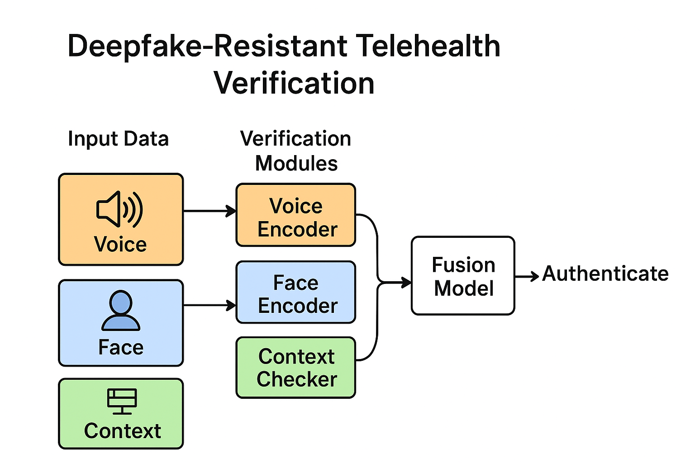

# Deepfake-Resistant Telehealth Verification

## Overview
This project implements a **multi-factor verification system** for telehealth security, designed to resist deepfake impersonation attacks.  
It combines:
- 🎙️ **Voice spectral analysis** (CNN-based embeddings)
- 👤 **Facial micro-motion detection** (transformer + ResNeXt)
- 🌐 **Contextual metadata checks** (IP, device, timing)

✅ Results:  
- 95% detection rate (TPR)  
- <3% false positives  
- <250ms latency (real-time viable)  

---

## Why This Matters
Telehealth has become essential, but deepfakes threaten **patient safety, HIPAA compliance, and national security**.  
This project contributes to the U.S. **National Cybersecurity Strategy (2023)** by securing healthcare communications against AI-driven threats.

---

## Features
- Multi-modal biometric fusion
- Privacy-preserving (federated learning + differential privacy).
- WebRTC-based middleware integration
- SOC hooks (Splunk/ELK connectors)
- HIPAA/GDPR compliance flow diagrams

---

## Architecture


---

## Getting Started
```bash
git clone https://github.com/picassoendless/deepfake-resistant-telehealth.git
cd deepfake-resistant-telehealth
pip install -r requirements.txt
python src/main.py

